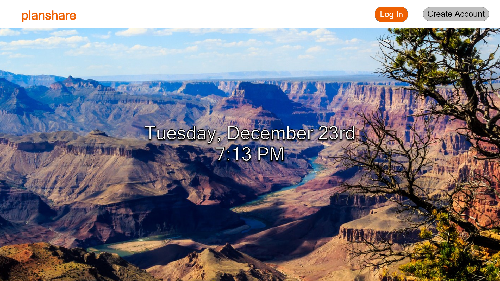

# PlanShare (Work In Progress)

This project is currently a work in progress. I am creating a MERN based (MongoDB, Express.js, React.js, Node.js) social media application that will allow users to create plans and share them with their friends. The goal is to have an itinerary that can be easily sent to people when you have an idea for a meetup, date, vacation, etc. The project uses TypeScript as the primary language. I am creating the data model, mockups, etc all on my own before coding each page using AdobeXD and various Google documents. Those documents can be found in my [planshare google drive folder](https://drive.google.com/drive/folders/1JGAU7YPz0kq64mpNnAigeOCgiiaWOkoE?usp=sharing).

